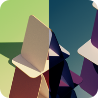

# TriPeaks RUSH

A fork of [Tri Peaks NEUE](https://github.com/mimoguz/tripeaks_neue), using Flutter. This project aims to add a generation algorithm that always makes solvable games and a new game mode. 

## License

This software is available under GNU Affero General Public License (AGPL) Version 3, except:

- _fonts/actions.ttf:_ This file includes symbols derived from Material Icons, and therefore available under Apache License Version 2.0 (same as Material Icons).
- _fonts/Outfit-VariableFont_wght.ttf:_ [Outfit Fonts](https://github.com/Outfitio/Outfit-Fonts) were designed by Smartsheet Inc, Rodrigo Fuenzalida, and available under SIL Open Font License (OFL) Version 1.1.

<a href="./.github/readme/tri_peaks_wallpapers.zip?raw=true" download></img></a>
